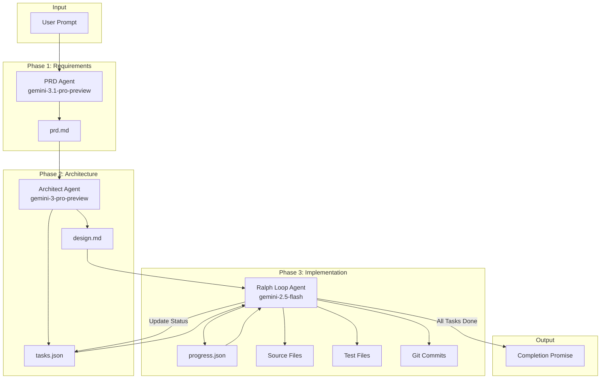

# adk-ralph

Ralph is a multi-agent autonomous development system that transforms a user's idea into a fully implemented project. It uses three specialized agents working in sequence:

1. **PRD Agent** — Creates structured requirements from user prompts
2. **Architect Agent** — Creates system design and task breakdown from PRD
3. **Ralph Loop Agent** — Iteratively implements tasks until completion

## Features

- **Multi-Agent Pipeline**: Three specialized agents for requirements, design, and implementation
- **Interactive Chat Mode**: REPL-based conversational interface with session persistence
- **Priority-Based Task Selection**: Implements highest priority tasks first with dependency checking
- **Progress Tracking**: Append-only progress log captures learnings and gotchas
- **Test-Before-Commit**: Only commits code that passes tests
- **Multi-Provider LLM Support**: Anthropic, OpenAI, Gemini, Ollama
- **Multi-Language Support**: Rust, Python, TypeScript, Go, Java
- **Telemetry Integration**: Full observability with OpenTelemetry

## Architecture

Ralph follows an iterative, file-driven development pattern where agents learn from their previous work through persistent files (`progress.json`, `tasks.json`) rather than in-memory state.



### Three-Agent Pipeline

| Phase | Agent | Input | Output | Purpose |
|-------|-------|-------|--------|---------|
| 1. Requirements | PRD Agent | User prompt | `prd.md` | Generate structured requirements with user stories |
| 2. Design | Architect Agent | `prd.md` | `design.md`, `tasks.json` | Create architecture and task breakdown |
| 3. Implementation | Ralph Loop Agent | `design.md`, `tasks.json`, `progress.json` | Source code, tests, commits | Iteratively implement all tasks |

### Default Agent Model Strategy

| Agent | Default Provider | Default Model | Thinking | Purpose |
|-------|-----------------|---------------|----------|---------|
| PRD Agent | Gemini | `gemini-3.1-pro-preview` | Configurable | Deep requirements analysis |
| Architect Agent | Gemini | `gemini-3-pro-preview` | Configurable | Complex design decisions |
| Ralph Loop Agent | Gemini | `gemini-2.5-flash` | Disabled | Fast implementation iterations |

> **Note:** Gemini 3 models require [thought signatures](https://ai.google.dev/gemini-api/docs/thought-signatures) for tool calls. Since `adk-rust` v0.3.2 doesn't support this yet, the loop agent (which makes heavy use of tools) defaults to `gemini-2.5-flash`. The PRD and Architect agents work fine with Gemini 3 since they don't use multi-turn tool calling.

All agents are fully configurable — see [Configuration](#configuration) for per-agent provider and model overrides.

### ADK-Rust Integration

Ralph is built on the [adk-rust](https://crates.io/crates/adk-rust) framework, using its unified crate with feature flags:

- **Core**: `Agent`, `Content`, `Part` traits for agent abstraction
- **Models**: Provider clients for Anthropic, OpenAI, Gemini, Ollama
- **Runner**: Agent execution with session management
- **Sessions**: `InMemorySessionService` for session state
- **Telemetry**: OpenTelemetry integration for tracing and metrics

### Tools

| Tool | Purpose | Operations |
|------|---------|------------|
| **FileTool** | File system operations | read, write, append, list, delete |
| **GitTool** | Version control | status, add, commit, diff, log, branch |
| **TestTool** | Test execution | run, check, coverage (multi-language) |
| **ProgressTool** | Progress tracking | read, append, summary |
| **TaskTool** | Task management | list, get_next, update_status, complete |
| **AddFeatureTool** | Feature additions | append to PRD and regenerate tasks |
| **RunPipelineTool** | Pipeline execution | run full or partial pipeline |
| **RunProjectTool** | Project execution | build, run, test with language detection |
| **GetTimeTool** | Time utilities | current time for progress entries |
| **WebSearchTool** | Web search | search for documentation and solutions |

## Installation

Add to your `Cargo.toml`:

```toml
[dependencies]
adk-ralph = { path = "../adk-ralph" }
```

Or clone and build directly:

```bash
git clone https://github.com/zavora-ai/adk-ralph.git
cd adk-ralph
cargo build --release
```

## Quick Start

```bash
# 1. Copy the example configuration
cp .env.example .env

# 2. Set your API key (pick your provider)
# For Gemini (default):
export GEMINI_API_KEY=your-key
# Or Anthropic:
export ANTHROPIC_API_KEY=your-key
# Or OpenAI:
export OPENAI_API_KEY=your-key

# 3. Run Ralph with a project idea
cargo run -- "Create a CLI calculator in Rust"

# 4. Or start interactive chat mode
cargo run -- chat
```

## CLI Usage

```bash
ralph <prompt>                    # Run full pipeline with a prompt
ralph run <prompt>                # Same as above (explicit)
ralph resume --phase design       # Resume from a specific phase
ralph chat                        # Start interactive REPL
ralph chat --resume               # Resume previous chat session
ralph chat --auto-approve         # Skip change confirmations
ralph status                      # Show pipeline status and artifacts
ralph config                      # Validate current configuration
```

### Global Options

```bash
ralph -d verbose <prompt>         # Verbose output with tool calls
ralph -d debug <prompt>           # Full debug output
ralph -p /path/to/project <prompt> # Override project output directory
```

## Configuration

Ralph is configured via environment variables with sensible defaults. See `.env.example` for all options.

### API Keys (Required)

Set at least one API key based on your chosen provider:

| Variable | Description |
|----------|-------------|
| `GEMINI_API_KEY` | Google Gemini API key (default provider) |
| `ANTHROPIC_API_KEY` | Anthropic API key for Claude models |
| `OPENAI_API_KEY` | OpenAI API key for GPT models |

### Per-Agent Model Configuration

Each agent can use a different model and provider:

| Variable | Default | Description |
|----------|---------|-------------|
| `RALPH_PRD_PROVIDER` | `gemini` | Provider for PRD Agent |
| `RALPH_PRD_MODEL` | `gemini-3.1-pro-preview` | Model for PRD Agent |
| `RALPH_PRD_THINKING` | `false` | Enable thinking mode |
| `RALPH_ARCHITECT_PROVIDER` | `gemini` | Provider for Architect Agent |
| `RALPH_ARCHITECT_MODEL` | `gemini-3-pro-preview` | Model for Architect Agent |
| `RALPH_ARCHITECT_THINKING` | `false` | Enable thinking mode |
| `RALPH_LOOP_PROVIDER` | `gemini` | Provider for Ralph Loop Agent |
| `RALPH_LOOP_MODEL` | `gemini-2.5-flash` | Model for Ralph Loop Agent |
| `RALPH_LOOP_THINKING` | `false` | Enable thinking mode |

**Supported Providers**: `anthropic`, `openai`, `gemini`, `ollama`

### Current Model Names (Feb 2026)

| Provider | Models |
|----------|--------|
| Gemini | `gemini-2.5-pro`, `gemini-2.5-flash`, `gemini-2.5-flash-lite`, `gemini-3-pro-preview`, `gemini-3-flash-preview` |
| Anthropic | `claude-opus-4-6`, `claude-sonnet-4-5-20250929`, `claude-haiku-4-5-20251001`, `claude-sonnet-4-20250514` |
| OpenAI | `gpt-5.2`, `gpt-5.1`, `gpt-5`, `gpt-5-mini`, `gpt-5-nano`, `gpt-4.1`, `o3`, `o4-mini` |

### Execution Settings

| Variable | Default | Range | Description |
|----------|---------|-------|-------------|
| `RALPH_MAX_ITERATIONS` | `50` | 1–1000 | Maximum loop iterations |
| `RALPH_MAX_TASK_RETRIES` | `3` | 1–10 | Maximum retries for failed tasks |
| `RALPH_DEBUG_LEVEL` | `normal` | minimal/normal/verbose/debug | Output verbosity |
| `RALPH_COMPLETION_PROMISE` | `All tasks completed successfully!` | — | Message on completion |

### File Paths

All paths are relative to `RALPH_PROJECT_PATH`:

| Variable | Default | Description |
|----------|---------|-------------|
| `RALPH_PROJECT_PATH` | `.` | Base directory for the project |
| `RALPH_PRD_PATH` | `prd.md` | Path to PRD file |
| `RALPH_DESIGN_PATH` | `design.md` | Path to design file |
| `RALPH_TASKS_PATH` | `tasks.json` | Path to tasks file |
| `RALPH_PROGRESS_PATH` | `progress.json` | Path to progress file |

### Telemetry

| Variable | Default | Description |
|----------|---------|-------------|
| `RALPH_TELEMETRY_ENABLED` | `true` | Enable/disable telemetry |
| `RALPH_SERVICE_NAME` | `ralph` | Service name for telemetry |
| `RALPH_LOG_LEVEL` | `info` | Log level: trace, debug, info, warn, error |
| `RALPH_OTLP_ENDPOINT` | (none) | OTLP endpoint for telemetry export |

### Example Configurations

#### Minimal (Gemini — default)

```bash
export GEMINI_API_KEY=your-key
cargo run -- "Create a REST API in Rust"
```

#### Anthropic with Thinking

```bash
export ANTHROPIC_API_KEY=sk-ant-...
export RALPH_PRD_PROVIDER=anthropic
export RALPH_PRD_MODEL=claude-sonnet-4-5-20250929
export RALPH_PRD_THINKING=true
export RALPH_ARCHITECT_PROVIDER=anthropic
export RALPH_ARCHITECT_MODEL=claude-sonnet-4-5-20250929
export RALPH_ARCHITECT_THINKING=true
export RALPH_LOOP_PROVIDER=anthropic
export RALPH_LOOP_MODEL=claude-haiku-4-5-20251001
```

#### OpenAI

```bash
export OPENAI_API_KEY=sk-...
export RALPH_PRD_PROVIDER=openai
export RALPH_PRD_MODEL=gpt-5
export RALPH_ARCHITECT_PROVIDER=openai
export RALPH_ARCHITECT_MODEL=gpt-5
export RALPH_LOOP_PROVIDER=openai
export RALPH_LOOP_MODEL=gpt-5-mini
```

#### Local Ollama (No API costs)

```bash
export RALPH_PRD_PROVIDER=ollama
export RALPH_PRD_MODEL=llama3.1:70b
export RALPH_ARCHITECT_PROVIDER=ollama
export RALPH_ARCHITECT_MODEL=llama3.1:70b
export RALPH_LOOP_PROVIDER=ollama
export RALPH_LOOP_MODEL=llama3.1:8b
```

#### Programmatic

```rust
use adk_ralph::{RalphConfig, AgentModelConfig, ModelConfig};

let config = RalphConfig::builder()
    .agents(AgentModelConfig {
        prd_model: ModelConfig::new("gemini", "gemini-3.1-pro-preview")
            .with_thinking()
            .with_max_tokens(8192),
        architect_model: ModelConfig::new("gemini", "gemini-3-pro-preview")
            .with_thinking()
            .with_max_tokens(8192),
        ralph_model: ModelConfig::new("gemini", "gemini-2.5-flash")
            .with_max_tokens(4096),
    })
    .max_iterations(100)
    .project_path("./my-project")
    .build()?;
```

## Data Models

### PRD (prd.md)

Product Requirements Document with user stories and acceptance criteria.

### Design (design.md)

System architecture with components, technology stack, and file structure.

### Tasks (tasks.json)

Structured task list with priorities, dependencies, and status tracking.

```json
{
  "project": "project-name",
  "language": "rust",
  "tasks": [
    {
      "id": "T-001",
      "title": "Set up project structure",
      "priority": 1,
      "status": "pending",
      "dependencies": []
    }
  ]
}
```

### Progress (progress.json)

Append-only log of completed work, learnings, and gotchas.

```json
{
  "project": "project-name",
  "entries": [
    {
      "task_id": "T-001",
      "approach": "Created standard Rust project layout",
      "learnings": ["Used workspace structure"],
      "gotchas": ["Remember to add crates to workspace"]
    }
  ]
}
```

## Telemetry

Ralph captures telemetry via OpenTelemetry:

- **Spans**: `ralph.prd_generation`, `ralph.architect_design`, `ralph.loop_iteration`, `ralph.task_execution`, `ralph.tool_call`
- **Metrics**: `ralph_iterations_total`, `ralph_tasks_completed`, `ralph_tasks_failed`

```bash
# Start Jaeger for local tracing
docker run -d --name jaeger \
  -p 16686:16686 -p 4317:4317 \
  jaegertracing/all-in-one:latest

export RALPH_OTLP_ENDPOINT=http://localhost:4317
# View traces at http://localhost:16686
```

## Example Prompts

Ralph works best with clear, detailed project descriptions:

```bash
# CLI tool
cargo run -- "Create a CLI task manager in Rust with clap, JSON storage, and colored output"

# Web API
cargo run -- "Create a REST API for a bookstore in Python using FastAPI with SQLite and JWT auth"

# Library
cargo run -- "Create a Go rate limiting library with token bucket and sliding window algorithms"

# Simple one-liner
cargo run -- "Create a Rust CLI for converting CSV to JSON"
```

See `examples/prompts/` for detailed prompt templates across languages.

## Development

```bash
# Run all tests
cargo test

# Run with verbose output
cargo run -- -d verbose "Your prompt"

# Validate configuration
cargo run -- config
```

## License

Apache-2.0
