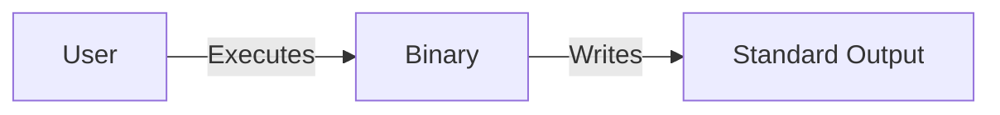

# System Design: hello-world

## Architecture Overview

A minimal command-line executable that outputs 'Hello, World!' to the standard output stream to verify the runtime environment.

## Component Diagram


```

## Components

### Main Entry Point

**Purpose**: Entry point of the application that prints the message and terminates.

**Interface**:
- main

**File**: `src/main.rs`

## File Structure

```
hello-world/
├── src/
│   └── main.rs
└── Cargo.toml
```

## Technology Stack

- **Language**: Rust
- **Testing**: cargo test
- **Build Tool**: cargo

## Design Decisions

- Use Standard Output (stdout): Requirement specifies printing to console; stdout is the standard channel for this.
- Single Binary: Scope is trivial; no need for libraries or modules.

