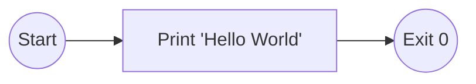

# System Design: hello-world

## Architecture Overview

A minimal command-line application that outputs a static greeting to standard output to verify the execution environment.

## Component Diagram


```

## Components

### Entry Point

**Purpose**: Main execution entry point that prints the greeting

**Interface**:
- main

**File**: `src/main.rs`

## File Structure

```
hello-world/
├── src/
│   └── main.rs
└── Cargo.toml
```

## Technology Stack

- **Language**: rust
- **Testing**: cargo test
- **Build Tool**: cargo

## Design Decisions

- Single Source File: The scope is trivial; separating logic into modules would add unnecessary boilerplate.

